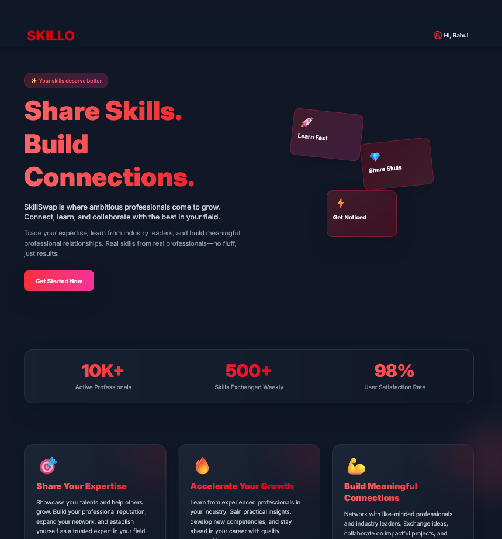
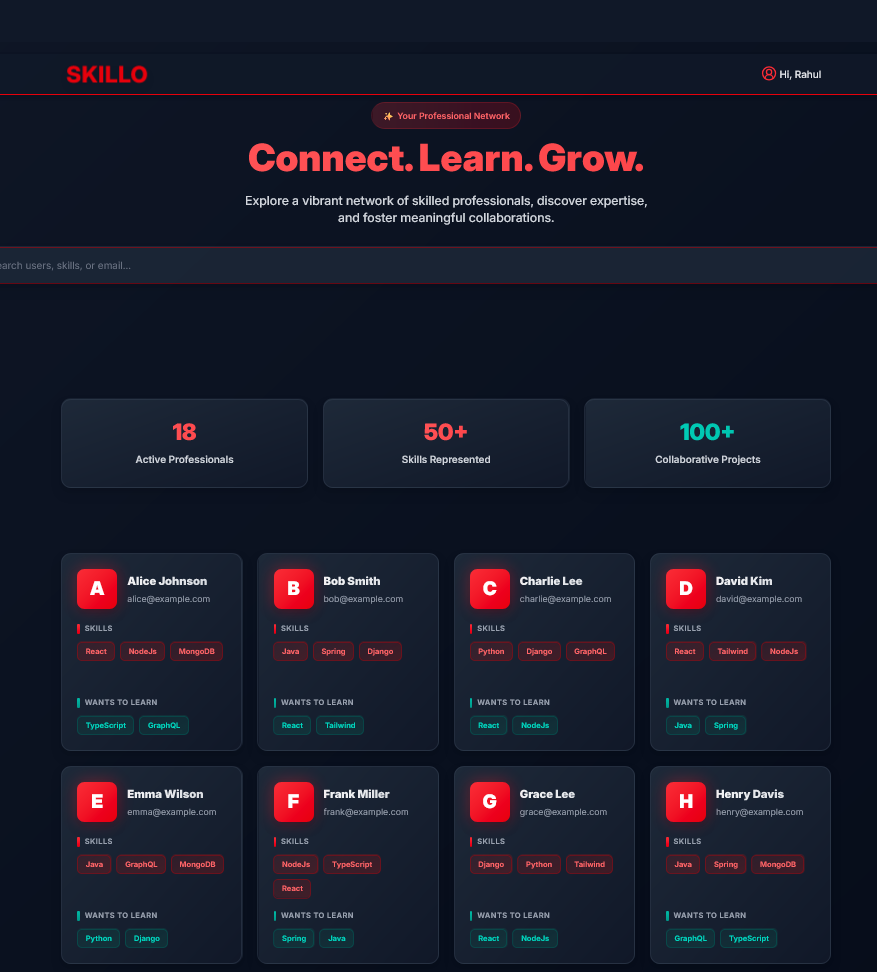
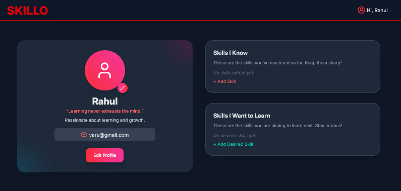
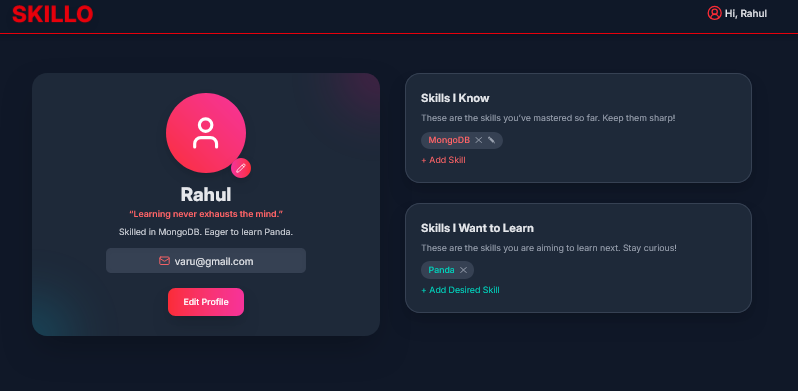

# Skillo ⚡

[](https://opensource.org/licenses/MIT)  
[](https://github.com/yourusername/skillo/stargazers)  
[](https://github.com/yourusername/skillo/network)  
[](https://github.com/yourusername/skillo/issues)  

---

## ✨ About Skillo

**Skillo** is a **Skill Exchange Platform** that lets users:

- Showcase their **current skills**.  
- Track **skills they want to learn**.  
- Connect with like-minded people for growth and collaboration.  
- Explore other users' profiles with detailed skill highlights.  

Skillo focuses on **simplicity, interactivity, and modern UI/UX design** to make skill management fun and efficient.

---

## 🚀 Features

- 🎯 Add, edit, and delete skills effortlessly.  
- 👨‍💻 Interactive **user cards** with skill highlights.  
- 🌈 Clean **pastel-themed UI** with soft gradients.  
- 📱 Fully responsive design for desktop and mobile.  
- 🔒 Authentication with login/signup flows.  

---

## 🎨 Screenshots

### Landing Page


### Login / Signup


### Profile & Skills


### User Cards & Interaction


---

## 💻 Tech Stack

| Layer       | Technology                    |
|------------|--------------------------------|
| Frontend    | React, Tailwind CSS           |
| State       | Zustand                        |
| Backend     | Node.js, Express               |
| Database    | MongoDB                        |
| HTTP Client | Axios                          |

---

## 🛠️ Installation

1. Clone the repo:

```bash
git clone https://github.com/yourusername/skillo.git
cd skillo

    Install dependencies:

npm install

    Start the development server:

npm start

    Open in your browser: http://localhost:3000

🎯 Usage

    Add your skills in the "Skills I Know" section.

    Add skills you want to learn in "Skills I Want to Learn".

    Edit or delete skills using inline controls.

    Explore other users' profiles and their skill highlights.

🌈 Future Features

    Skill-based user matching.

    Messaging system between users.

    Gamification with badges and leaderboards.

    Dark Mode toggle.

📄 License

MIT © 2025 Skillo
